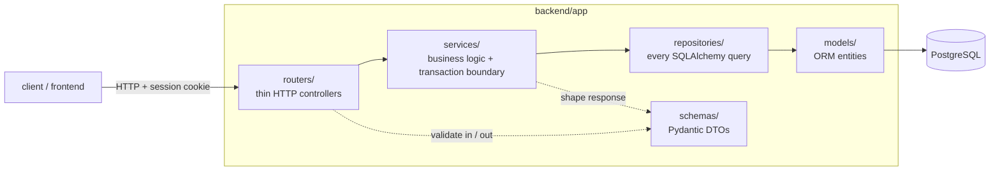

# Backend architecture

FastAPI + SQLAlchemy 2.0 + Alembic + PostgreSQL 16. The code is packaged **by
layer**; a request flows straight down and the return value flows back up.



## The layers

| Layer | Responsibility | Rules |
|---|---|---|
| `routers/` | Map a URL + method to a call. Parse the request, apply `Depends(...)`, return a dict/model. | No business logic, no raw SQL. One `APIRouter(prefix="/api/...")` per resource. |
| `services/` | The actual work, and the **transaction boundary** — a service function calls `db.commit()`. Also shapes the response dict. | May call several repositories. Never touches HTTP (`Request`, `HTTPException` for domain errors is the one pragmatic exception). |
| `repositories/` | Every `select` / `insert` / `update`. Flat modules of functions, not classes. Tenant scoping is always an explicit `.where(Model.user_id == user_id)`. | No business rules, no `commit`. Returns ORM objects or plain values. |
| `models/` | SQLAlchemy 2.0 declarative entities, one per file. Cross-entity links are string forward-refs; `TYPE_CHECKING` imports name them for readers and mypy. | No queries, no behaviour beyond column defaults. |
| `schemas/` | Pydantic request/response models + validation (`schemas/common.py` has the shared `Page[T]` and `NonBlankStr`). | The router's `response_model=` is the real output contract. |
| `utilities/` | Dependency-free helpers: `config.py` (settings), `common.py` (weight constants + `utcnow`), `extract.py` (résumé text extraction). | Importable from any layer. |
| `screening/` | The multi-agent integrity pipeline — its own world. See [`screening.md`](./screening.md). | Providers never touch the DB; the coordinator owns the run. |

## Request lifecycle

1. **Session** — `get_current_user` (in `auth/dependencies.py`) reads the
   `session` cookie, verifies the JWT (`auth/security.py`, algorithm pinned to
   HS256), loads the `User`. Missing/invalid -> 401.
2. **Ownership** — routes with a resource id in the path depend on
   `get_owned_role` / `get_owned_candidate` / `get_owned_screening_run`, which
   resolve through the current user and return **404** if the row isn't theirs.
   Routes with the id in the *body* do the same check inline.
3. **Work** — the router calls one `services.*` function, which uses
   `repositories.*` to read/write and `db.commit()`s.
4. **Response** — the service returns a plain dict; FastAPI validates it against
   the router's `response_model=` and serialises it.

`get_db` (in `repositories/database.py`) yields a `Session` per request and
closes it in a `finally`.

## Configuration

All settings come from environment variables, read by `pydantic-settings`
(`utilities/config.py`). The env var name is the upper-cased field name
(`SCREENING_CONCURRENCY` -> `screening_concurrency`); `pydantic-settings` does
the type coercion. `get_settings()` is an `@lru_cache` singleton and refuses to
return if `APP_SECRET_KEY` is missing, the `.env.example` placeholder, or under
32 characters — a weak signing key fails the boot loudly rather than degrading.
`.env` is loaded by docker-compose and Vite, **not** by the app itself.

## Auth model (why it looks the way it does)

- **Argon2id** password hashes in PHC string format (`argon2-cffi` directly),
  transparently re-hashed on login when parameters change.
- **Session JWT in an httpOnly, SameSite=Lax cookie** — never `localStorage`, so
  an XSS can't exfiltrate it. `Secure` when `COOKIE_SECURE=true`.
- **No account enumeration** — unknown email and wrong password return an
  identical response, and the unknown-email path still spends an Argon2 verify
  so response timing doesn't leak.
- **Login throttling** keyed on client IP *and* submitted email (in-process;
  per-instance — a shared Redis counter is the production fix).
- **404, not 403** on another tenant's resource.

## Migrations

`alembic/versions/` — hand-written, linear (`0001`, `0002`). The URL is injected
from `get_settings().database_url` in `alembic/env.py`, never from
`alembic.ini`. `start.sh` runs `alembic upgrade head` before the app boots.

## Tooling

`backend/pyproject.toml` holds the ruff, mypy, and pytest config.

```bash
cd backend
ruff check . && ruff format --check .   # lint + format
mypy app                                # types (CRUD layers strict; screening loose for now)
python -m pytest -m no_db               # fast, no database
docker compose exec backend pytest      # full suite (needs Postgres)
pre-commit run --all-files              # everything the CI runs
```
