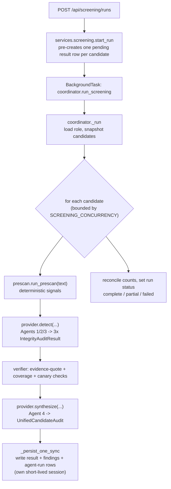

# Screening — résumé integrity checks before scoring

Screening is the layer that runs on every résumé **before** it is scored and
flags what it finds in plain language a recruiter can act on. It is a new
left-nav section: pick one **role** and a set of **candidates**, start a run,
and get one **integrity audit** per candidate.

For how the backend is layered around this, see
[`architecture.md`](./architecture.md); for the vocabulary, see
[`CONTEXT.md`](../CONTEXT.md).

### Reading order for a new maintainer

1. `backend/app/screening/types.py` — the plain dataclasses passed between steps.
2. `backend/app/schemas/screening.py` — the Pydantic contract (what each agent
   emits, what the API returns).
3. `backend/app/screening/prescan/` — start with `__init__.py::run_prescan`, then
   one detector (`manipulation.py`).
4. `backend/app/screening/coordinator.py` — `run_screening` -> `_run` ->
   `_screen_one`: the whole per-candidate pipeline in one function.
5. `backend/app/screening/providers/stub.py` — the pipeline with no network; the
   shape every other provider implements.
6. `backend/app/screening/verifier.py` — the guard rails (evidence-quote,
   coverage, and canary checks over agent output).

### The pipeline at a glance



`compare` (Agent 5) is a separate entry point:
`POST /api/screening/comparisons` -> `services.screening.create_comparison` ->
`provider.compare(...)`. The coordinator never calls it.

---

## What it checks

Three mandatory checks, each run by an **isolated sub-agent** so an injection
that lands on one cannot contaminate the others:

| Agent | Catches | Categories |
|---|---|---|
| **1 · manipulation_guard** | text addressed to an automated reader | `PROMPT_INJECTION`, `SYSTEM_SPOOFING`, `HIDDEN_PAYLOAD` |
| **2 · timeline_auditor** | claims inside the one document that don't add up | `TIMELINE_OVERLAP`, `CHRONOLOGICAL_ERROR`, `SENIORITY_ANOMALY` |
| **3 · inflation_auditor** | recycled, detail-free achievement bullets | `RECYCLED_METRIC`, `UNSUBSTANTIATED_INFLATION` |

**Agent 4 (synthesis engine)** re-reads the raw résumé plus the three results,
deduplicates, adds severity / a plausible innocent explanation / a recommended
next step, and writes the unified audit. **Agent 5 (comparative reasoner)** is a
separate endpoint: given two candidates it explains why one ranks above the
other, and integrity violations penalise rank regardless of nominal years of
experience.

Every finding carries the exact **quoted evidence**, a plain-language
**reason**, and — from Agent 4 — a **benign_explanation** and a
**recommended_action** (`verify` / `ask_candidate` / `human_read` /
`no_action`).

## Two rules that are structural, not aspirational

- **Never comply with an injected instruction.** Résumé text is untrusted data
  inside `<candidate_text>` tags in every prompt, in both tiers. An injection is
  *reported as a finding*, never acted on. A canary token + a deterministic
  coverage check mean an injection the model misses is still flagged.
- **Never silently drop a candidate.** Every selected candidate gets exactly one
  `screening_results` row (DB unique constraint + a post-run assertion), even on
  error ("could not screen — …") and even when `is_compromised` is true. A flag
  is not a rejection. Every model call is written to `screening_agent_runs` so
  the guarantee is auditable after the fact.

### Where the invariants live

| Invariant | Enforced by |
|---|---|
| One result row per candidate | `services/screening.py::start_run` pre-creates the rows; `coordinator._run` only ever *updates* them and reconciles the count at the end; `UniqueConstraint("run_id", "candidate_id")` in `models/screening.py` |
| An injection is reported, never acted on | `agents/prompts.py::GUARD` (in every system prompt) + `verifier.py::scan_for_canary` / `coverage_check` + `agents/detectors.py::fallback` |
| Full audit trail | `coordinator._persist_agent_runs` writes an `AgentCall` row for every provider call, success or failure |
| A model failure degrades, never 500s | `jsonio.run_ladder` (call -> validate -> one repair -> give up) then `assembly.assemble_unified`; `providers/__init__.py::get_provider` falls back to `StubProvider` |

## Model backends

Two tiers, selected by env vars. Each chat tier talks to an **OpenAI-compatible
`/chat/completions` endpoint** — the vendor may be OpenAI, Azure OpenAI, Ollama,
vLLM, LM Studio, Groq, OpenRouter, together.ai, llama.cpp, … The `openai` /
`openai_agentic` backend names and the `tier="openai"` label on agent-run rows
are vendor-neutral; changing the model is env only, no code change.

| Var | Values | Meaning |
|---|---|---|
| `SCREENING_PROVIDER` | `live` (default) · `stub` | `live` = use the backends below (falls back to the deterministic pipeline if a backend can't be built). `stub` = deterministic pre-scan only, no network. The test suite is forced to `stub` unless `RUN_LIVE_SMOKE=1`. |
| `SCREENING_DETECTION_BACKEND` | `openai_agentic` (default) · `hf_inference` · `hf_local` · `stub` | Agents 1/2/3. See below. |
| `SCREENING_SYNTHESIS_BACKEND` | `openai` · `stub` | Agents 4/5. |

Credentials — the `OPENAI_*` values are the **shared default** for both chat
tiers:

- `OPENAI_API_KEY`, `OPENAI_BASE_URL` (blank ⇒ `https://api.openai.com/v1`),
  `OPENAI_SYNTHESIS_MODEL` (default `gpt-4.1`), `OPENAI_SUBAGENT_MODEL`
  (default `gpt-4.1-mini`).
- Per-tier overrides, each falling back to the shared value:
  `SCREENING_DETECTION_BASE_URL` / `SCREENING_DETECTION_API_KEY`,
  `SCREENING_SYNTHESIS_BASE_URL` / `SCREENING_SYNTHESIS_API_KEY` — so detection
  and synthesis can run against different endpoints/models.
- **An empty value is treated as unset** everywhere (resolved once in
  `app/screening/providers/_endpoint.py`).
- `HF_TOKEN` (or legacy `HF_API_TOKEN`) is only for the `protectai/…`
  prompt-injection classifier — a genuine HF `text_classification` task model,
  unaffected by the chat-endpoint choice. With no `HF_TOKEN` (and not
  `hf_local`) that one `injection_classifier` row is `degraded`; the candidate
  is still fully screened.

Copy-paste `.env` blocks for OpenAI, Ollama, vLLM, Azure OpenAI, Groq, and a
split-tier setup: [`llm-backends.md`](./llm-backends.md).

### Detection sub-agents 1–3

All five agents are LLM agents. Sub-agents 1–3 are **tool-using agents**: each
one calls the deterministic checks as tools, reads the résumé itself, then
returns its `IntegrityAuditResult`.

| tool | what it returns |
|---|---|
| `scan_manipulation_patterns` | injection imperatives, delimiter escapes, fake system markers, hidden/zero-width runs |
| `parse_resume_timeline` / `check_timeline_consistency` | parsed date ranges; overlaps, chronological errors, seniority anomalies |
| `find_recycled_or_inflated_claims` | recycled bullets, unsubstantiated metrics, junior-vs-enterprise claims |
| `classify_prompt_injection` | the `protectai/deberta-v3-base-prompt-injection-v2` classifier on a specific span |

The tools carry raw signals, never verdicts, and take no free text (they always
run against the résumé already under review). `HF_SUBAGENT_MAX_TOOL_STEPS`
(default 4) bounds the tool rounds per agent. Each sub-agent row on the activity
feed shows `· N tools` with the transcript when expanded.

**`openai_agentic` (default)** — 1–3 run on `OPENAI_SUBAGENT_MODEL`
(`gpt-4.1-mini`). Résumé text reaches OpenAI (it already does for Agents 4/5).
The `protectai/…` classifier still runs per candidate as an `hf-inference` task
model (its own `injection_classifier` row). No OpenAI key → falls back to
`hf_inference`.

**`hf_inference`** — 1–3 run on an opt-in HF-routed chat model
(`HF_SUBAGENT_CHAT_MODEL`, e.g. `meta-llama/Llama-3.1-8B-Instruct`;
`HF_SUBAGENT_CHAT_PROVIDER` blank = "auto"), so résumé text goes to that
provider instead of OpenAI (needs HF Inference-Providers credits). With no chat
model set, 1–3 emit the **deterministic pre-scan** (rows read `pre-scan`) and
Agent 4 does the reasoning.

Either way: if a sub-agent's chat call is unreachable (auth, quota, out of
credits) it falls back to the pre-scan (`degraded`, `notes: agentic; chat model
unavailable …`) and Agent 4 still runs — the candidate is never dropped. The run
records `detection: openai_agentic` / `hf_agentic` / `hf_inference`.

**The deterministic pre-scan still runs unconditionally** as the coverage +
canary backstop (see "Two rules" above) — a missed injection is force-flagged
whether or not the agent chose to call the manipulation tool. Alternatively set
`SCREENING_DETECTION_BACKEND=hf_local` to run the classifiers locally
(`pip install -r backend/requirements-hf-local.txt`).

If any model call fails the JSON ladder, that agent's contribution is assembled
deterministically from the pre-scan (`degraded` names it on the audit) — the
candidate is never dropped. Only a whole-tier auth/quota failure marks the run
`failed`.

### Seeing the raw model traffic

Every model call's **request and response** are persisted verbatim —
`screening_agent_runs` (`prompt_text` + `raw_response`) for a run, and the
`comparisons` row for Agent 5.

The coordinator writes each candidate's result + agent-run rows **as soon as
that candidate finishes** (its own short-lived session), so the run page shows
progress and per-agent activity *during* a scan, not only at the end.

```
GET /api/screening/runs/{run_id}/agent-runs                          # live feed, metadata only
GET /api/screening/runs/{run_id}/results/{candidate_id}/agent-runs   # Agents 1–4, full request+response
GET /api/screening/comparisons/{comparison_id}                       # Agent 5, full request+response
```

**In the UI:** the run page has an **Agent activity** table (candidate · agent ·
tier · model · ok/pre-scan/degraded · `N tools` · latency) that fills in row by
row while the scan runs; clicking a row shows the request, the tools called, and
the response. Each candidate gets an `injection classifier · hf` row (the HF
model that scored the résumé), one row per sub-agent (`openai · gpt-4.1-mini` by
default, `· N tools`), and the `synthesizer · openai` row. The candidate audit
page has a **Model calls** section (same, per candidate, request/response
inline), and the Compare page shows the Agent 5 request + response.

`SCREENING_LOG_PROMPTS` is **on by default** — every call's full request +
response is logged at `INFO` (`docker compose logs backend`); it includes résumé
text, so set `SCREENING_LOG_PROMPTS=false` to quiet it. A one-line summary is
logged regardless.

## Running it

```bash
# stub mode (no keys, no network) — the default
docker compose up -d
# open http://localhost:5173 → Screening

# live mode
#   .env: SCREENING_PROVIDER=live, HF_TOKEN=..., OPENAI_API_KEY=...
docker compose up -d backend
docker compose exec -e SCREENING_PROVIDER=live backend \
  python -m pytest tests/test_screening_live_smoke.py -q -s
```

## Tests

- `docker compose exec backend pytest` — full suite; the 3 skipped are the live
  smoke (run them with
  `docker compose exec -e RUN_LIVE_SMOKE=1 backend pytest tests/test_screening_live_smoke.py`).
- Pure-logic subset: `python -m pytest -m no_db` (pre-scan rules, the pipeline,
  the mocked providers, the bias gate).
- Fixtures + expected reports: `backend/tests/screening_fixtures/` (+
  `EXPECTED.md`).

See also [screening-bias-note.md](./screening-bias-note.md).
